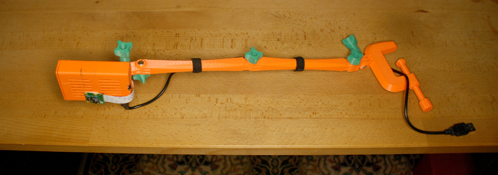

# Raspberry Pi food watcher

Take pictures of a table to detect dishes, crop them and upload the image to a remote server over WiFi.

Using:
 - Raspberry Pi 3
 - Raspberry Pi camera
 - [3D-printed parts](static/3d-files/)
